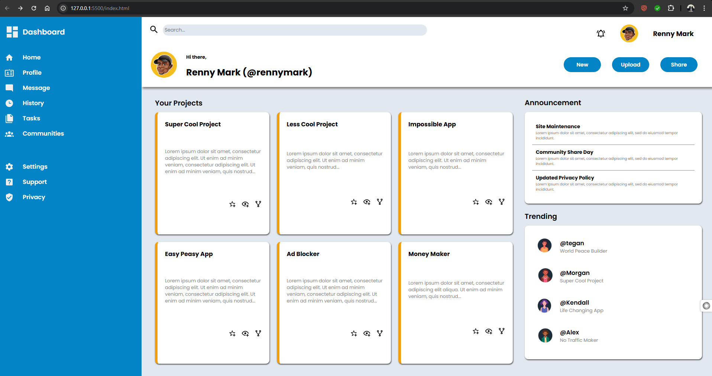

# 🛠️ Admin Dashboard

A clean, responsive **Admin Dashboard** built with **HTML** and **CSS**. This project showcases a fully functional UI layout for admin panels, featuring a sidebar menu, header bar, project cards, announcements, and a trending section — all crafted without using any JavaScript or CSS frameworks.

 <!-- Replace with your actual screenshot path -->

---

## 🚀 Features

- ✅ Sidebar navigation with icons
- ✅ Header with search bar and user controls
- ✅ Responsive project cards grid
- ✅ Announcements and trending users panel
- ✅ Pure HTML + CSS (no frameworks or libraries)
- ✅ Fully responsive design

---

## 📁 Project Structure

├── index.html           # Main HTML file
├── style.css            # Main stylesheet
├── Images/              # Icons and images used in the dashboard
│   ├── magnify.svg
│   ├── Cards_Icons/
│   │   ├── star-plus-outline.svg
│   │   ├── eye-plus-outline.svg
│   │   └── source-fork.svg
